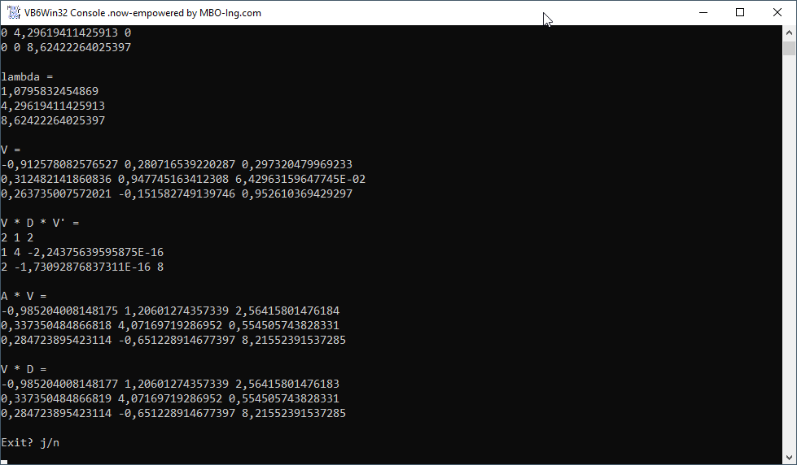

# Math_LRMaPack  
## Matrix calculations due to a code from Lutz Roeder, who ported LAPack to C#  

 

This project is a port of LAPack(Fortran) over MaPack(C#) to VBC. The program is a console app, no window.  
[LAPack](http://www.netlib.org/lapack/) is a Linear Algebra package, which contains many matrix related calculation functions and classes. The code of [LAPACK](https://github.com/Reference-LAPACK) can be found on GitHub.  
In the resources folder you will also find the original C#-code [MaPack](https://github.com/filgood/Mapack) from [Lutz Roeder](https://github.com/lutzroeder), as well as the corresponding VB.net-code.  
Project started around sept.2006.  

